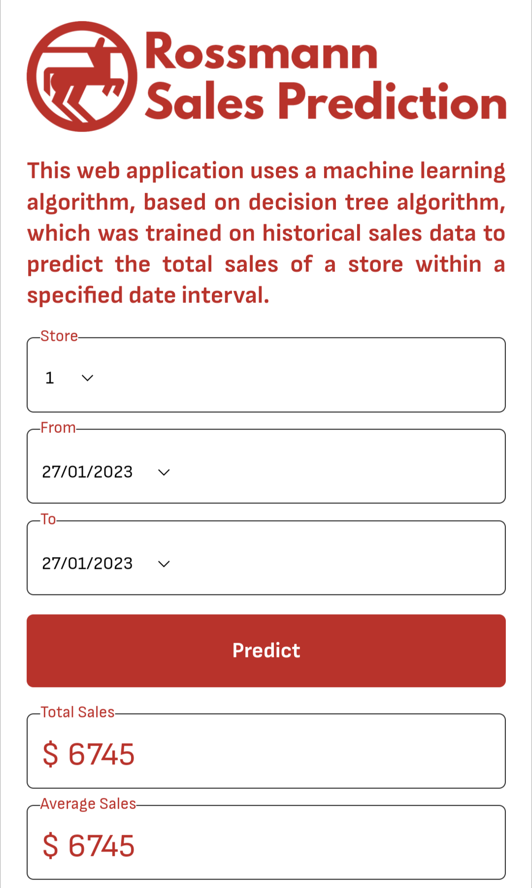

 
  
  Link to deployed model: http://rossmannsalesprediction-env-1.eba-3wi97vqp.ap-south-1.elasticbeanstalk.com/

In this project, I have attempted to analyze the retail sales dataset of Rossmann stores and build a predictive model to forecast the sales of any Rossmann store for any date. No personal information of customer is provided in this dataset.

## :book: Problem Statement

Rossmann operates over 3,000 drug stores in 7 European countries. Currently, Rossmann store managers are tasked with predicting their daily sales for up to six weeks in advance. Store sales are influenced by many factors, including promotions, competition, school and state holidays, seasonality, and locality. With thousands of individual managers predicting sales based on their unique circumstances, the accuracy of results can be quite varied.
Two datasets are given: one with store data and the other with historical sales data of 1115 stores from January 2013 to July 2015. The main objective is to understand existing data and after identifying the key factors that will predict future sales, a predictive model will be built for making forecasts about future sales.

## :book: Approach

1.	Understanding the business task.
2.	Import relevant libraries and define useful functions.
3.	Reading data from files given.
4.	Data pre-processing, which involves inspection of both datasets and data cleaning.
5.	Exploratory data analysis, to find which factors affect sales and how they affect it.
6.	Feature engineering, to prepare data for modelling.
7.	Modelling data and comparing the models to find out most suitable one for forecasting.
8.	Conclusion and recommendations to boost sales.

## :book: Exploratory Data Analysis

The following insights were gained from EDA:
<li>Mondays have most sales since most of the Sundays are closed.</li>
<li>Promotions seem to have a significant effect on sales but not for the number of customers. It is advisable to spend more on promos to get higher returns.</li>
<li>Store type b has higher sales and customers per store than other store types. More Store type b must be opened.</li>
<li>Assortment b is available only at store type b and it has more sales and customers than any other assortment. More assortment b must be stocked to meet the demands of customers.</li>
<li>Weekly sales and customers peak at the mid-December. It may be guessed that people buy drugs in advance just before the shops close for the holiday season.</li>

## :book: Modelling

## :book: Deployment

<li>A web application is built to demonstrate the working of the trained machine learning model using a combination of HTML, CSS, and JavaScript.</li>
<li>The prediction of sales using the trained ML model is carried out via a Flask API.</li>
<li>This web application is deployed with AWS Elastic Beanstalk, employing CI/CD pipeline.</li>

 

Link to deployed model: http://rossmannsalesprediction-env-1.eba-3wi97vqp.ap-south-1.elasticbeanstalk.com/

## :book: Data Visualization

An interactive dashboard was also created with Power BI to display charts associated with the analysis. It includes features like drill-through and customized tooltip.

Click [here](https://github.com/connect-midhunr/rossmann-sales-prediction/raw/main/dashboard/Dashboard_Rossmann.pbix) to download the data visualization.

## 📘: Conclusion

The following conclusions were drawn from Modelling:
<li>The model built using decision tree algorithm is the most accurate one. This can be attributed to higher number of categorical features in the data.</li>
<li>Decision tree based algorithms are slightly more accurate than linear regression based algorithms.</li>

## :scroll: Credits

Midhun R | Avid Learner | Data Analyst | Data Scientist | Machine Learning Enthusiast

 <i> Contact me for Data Science Project Collaborations</i>

## :books: References
<ul>
  <li>
GeeksforGeeks, 'Feature Encoding Techniques – Machine Learning'. [Online].

      
Available: https://www.geeksforgeeks.org/feature-encoding-techniques-machine-learning/

  </li>
  <li>
Medium, 'Which evaluation metric should you choose for evaluating your Classification and Regression models?'. [Online].

      
Available: https://medium.com/almabetter/which-evaluation-metric-should-you-choose-for-evaluating-your-classification-and-regression-models-1df8237f9a24

  </li>
  <li>
Analytics Vidhya, 'Decision Tree Algorithm – A Complete Guide'. [Online].

      
Available: https://www.analyticsvidhya.com/blog/2021/08/decision-tree-algorithm/

  </li>
</ul>
